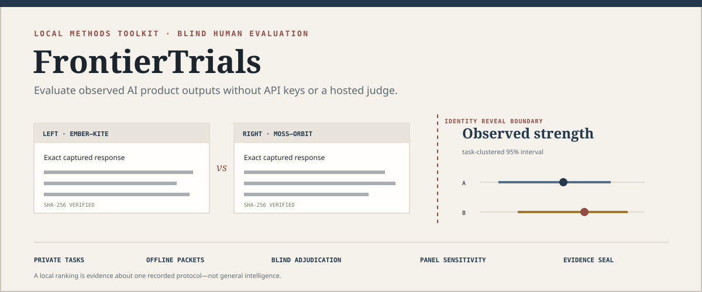
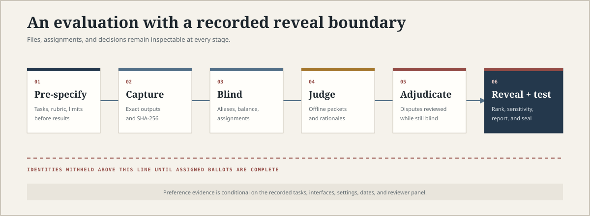

<div align="center">
  

  # FrontierTrials

  **Find which AI subscription works best for your real tasks—privately, without API keys.**

  [Try Personal Lab](https://caoshurong.github.io/frontiertrials/try/) ·
  [See the study report](https://caoshurong.github.io/frontiertrials/demo/trial-report.html) ·
  [Read the methodology](#study-mode)

  [](https://github.com/CAOShurong/frontiertrials/actions/workflows/ci.yml)
  [](https://caoshurong.github.io/frontiertrials/)
  [](https://www.python.org/)
  [](#privacy-and-trust-boundary)
  [](LICENSE)
</div>

FrontierTrials has two deliberately different surfaces:

- **Personal Lab** is a browser-local, zero-config tool for one person. Paste exact answers from
  ChatGPT, Claude, Gemini, Kimi, GLM, or any other product; compare anonymous pairs; save a task
  history; and export a self-contained report.
- **Study Mode** is the rigorous CLI workflow for decisions that must survive review. It adds
  frozen protocols, multiple reviewers, balanced assignments, blind adjudication, task-clustered
  uncertainty, panel sensitivity, integrity hashes, and evidence seals.

The application never logs into a provider, calls a model, sends a prompt to a hosted judge, or
claims that one local result measures general intelligence.

## Start in sixty seconds

Open the [Personal Lab](https://caoshurong.github.io/frontiertrials/try/). The app runs in your
browser and does not transmit the text you enter.

1. Give one real task a title and category.
2. Paste the exact prompt and two to four complete product answers.
3. Compare every anonymous pair.
4. Reveal the task-level result.
5. Save it locally to build your personal benchmark.

No account, API key, Python installation, or JSON configuration is required.

If you prefer to serve the same application entirely from your computer:

```bash
python -m pip install https://github.com/CAOShurong/frontiertrials/releases/download/v0.3.0/frontiertrials-0.3.0-py3-none-any.whl
frontiertrials open
```

`frontiertrials open` binds only to `127.0.0.1`, opens the Personal Lab, and applies a content
security policy that blocks network connections from the application.

## What a personal result means

Personal Lab answers a deliberately narrow question:

> On the tasks I recorded, which product's observed outputs did I prefer?

It reports pairwise wins, ties, losses, task categories, optional observed latency, and optional
monthly price. Saved comparisons are aggregated into a personal history.

It does **not** turn one reviewer or one prompt into a scientific leaderboard. With fewer than five
saved decisions, the dashboard labels the result an early signal. Even after that, the result still
applies only to the recorded tasks, interfaces, dates, product settings, and reviewer.

## Why not just use Arena?

Use Arena when you want an immediate public-model comparison, enjoy anonymous battle mode, and can
share the prompt with a hosted service. It is the better tool for casual exploration.

Use FrontierTrials when the decision is about the **subscription interfaces you actually use**:

| Decision | Arena | FrontierTrials |
|---|---:|---:|
| Try two hosted models immediately | Excellent | More setup |
| Compare a private or unpublished task | Not the intended boundary | Browser-local |
| Compare exact ChatGPT, Claude, or Gemini product outputs you captured | Not the same product surface | Core workflow |
| Accumulate your own category-specific preference history | Public crowd focus | Personal benchmark |
| Export a private, portable decision record | Not the primary workflow | Built in |
| Run a controlled multi-reviewer study | Public arena | Study Mode |

Arena's privacy notice warns users not to submit sensitive information they would not want shared
publicly. FrontierTrials exists for the separate case where prompts and captured outputs must remain
under the user's control.

## Three levels of evidence

### 1. Quick Compare

One task, one reviewer, two to four products. This is a fast blind taste test. Product labels are
removed from the review screen, but the app explicitly warns that masking cannot erase identities
the reviewer already remembers.

### 2. Personal Benchmark

Save varied tasks over time. The history page aggregates preference scores and category coverage
while keeping monthly price visible beside quality. This supports a practical subscription
decision without pretending that a personal sample is universal.

Good task categories include:

- research synthesis and paper-claim extraction;
- electrical-engineering reasoning and experimental planning;
- coding and debugging;
- table, chart, and figure interpretation;
- technical and bilingual writing;
- literature triage and replication planning.

### 3. Study Mode

Use the CLI when the result must be reviewed by colleagues, published, or defended. Study Mode
preserves the exact response lifecycle and adds safeguards that would only slow down a casual
personal comparison.

## Personal Lab data model

Personal Lab stores one versioned JSON document in the browser's `localStorage`. A saved trial
contains:

```text
task title + category + exact prompt
  └── 2–4 named products
        ├── exact pasted response
        ├── optional monthly price
        └── optional observed latency
  └── anonymous pair order
        ├── preference or cannot-judge choice
        ├── optional reason tags
        └── optional decision note
```

The History view can export or import this data as JSON. A result can also be exported as a
self-contained HTML report with no external scripts, fonts, or stylesheets.

## Privacy and trust boundary

### What stays local

- The hosted Personal Lab uses static HTML, CSS, and JavaScript.
- The app contains no analytics library, model client, API endpoint, or external asset.
- Prompts, answers, votes, and history remain in browser storage unless the user exports them.
- The local server binds only to the loopback interface and sends `connect-src 'none'`.

### What the tool cannot prove

- A displayed model label may not describe a provider's internal routing.
- A response pasted by a user is not cryptographic proof of provider origin.
- Hiding names on screen does not erase a reviewer's memory of answer style.
- Human preference is not factual correctness, safety, or scientific validity.
- A private prompt reduces public-benchmark exposure but does not establish novelty.
- A small or biased task set cannot support a general product ranking.

## Study Mode

Study Mode is a local-first evaluation workbench for people who use AI through subscription web
apps, desktop apps, or other interfaces without an API. It captures exact responses, freezes their
hashes, builds balanced blind comparisons, distributes self-contained judging packets, imports
human ballots, triages contested cases while identities remain hidden, reveals identities only
after the review gate closes, and publishes a portable report.

### Complete fictional study

- [Revealed interactive report](https://caoshurong.github.io/frontiertrials/demo/trial-report.html)
- [Offline blind judging packet](https://caoshurong.github.io/frontiertrials/demo/reviewer-one.html)
- [Blind adjudication queue](https://caoshurong.github.io/frontiertrials/demo/adjudication.md)
- [Ranking CSV](examples/demo/reports/ranking.csv)
- [Protocol snapshot](examples/demo/reports/protocol.md)

Every candidate, response, ballot, timing, and result in this committed demonstration is
fictional. It validates mechanics and packaging, not the performance of a real product.

### Study workflow

<p align="center">
  
</p>

```text
private tasks + rubric + observed candidate metadata
                         ↓
              manually capture exact outputs
                         ↓
              SHA-256 integrity verification
                         ↓
          deterministic aliases + balanced order
                         ↓
          self-contained offline judging packets
                         ↓
        imported human ballots + written rationales
                         ↓
       blind adjudication queue for contested cases
                         ↓
      complete-assignment gate + controlled reveal
                         ↓
 ranking + intervals + panel sensitivity + bias checks
                         ↓
       evidence seal + portable public or private report
```

### Create a study

```bash
frontiertrials init trials/assistant-choice \
  --title "My EE research assistant trial" \
  --question "Which subscription assistant best supports my weekly research workflow?" \
  --owner "Your name"
```

Add versioned JSON records for tasks, candidates, the rubric, and raters:

```bash
frontiertrials add task task-rf-debug.json --trial trials/assistant-choice
frontiertrials add candidate candidate-a.json --trial trials/assistant-choice
frontiertrials add rubric engineering-quality.json --trial trials/assistant-choice
frontiertrials add rater reviewer-one.json --trial trials/assistant-choice
```

Capture the complete UTF-8 response without cleaning or rewriting it:

```bash
frontiertrials capture \
  --trial trials/assistant-choice \
  --id response-rf-debug-candidate-a \
  --task rf-debug \
  --candidate candidate-a \
  --source captures/rf-debug-candidate-a.md \
  --captured-at 2026-08-05T09:00:00Z \
  --latency-seconds 42
```

Freeze aliases and reviewer assignments:

```bash
frontiertrials freeze \
  --trial trials/assistant-choice \
  --seed-file local-secret.txt \
  --reviews-per-pair 2

frontiertrials packet \
  --trial trials/assistant-choice \
  --rater reviewer-one \
  --output packets/reviewer-one.html
```

Import downloaded ballots and inspect contested cases before reveal:

```bash
frontiertrials import-ballots ballots-reviewer-one.json \
  --trial trials/assistant-choice
frontiertrials adjudicate \
  --trial trials/assistant-choice \
  --format markdown \
  --output reports/adjudication.md
```

Reveal, analyze, seal, and verify:

```bash
frontiertrials reveal --trial trials/assistant-choice
frontiertrials analyze --trial trials/assistant-choice --output reports/analysis.json
frontiertrials report --trial trials/assistant-choice
frontiertrials seal --trial trials/assistant-choice
frontiertrials verify --trial trials/assistant-choice
```

### Study analysis

Study Mode reports:

- Bradley–Terry relative preference strengths;
- task-clustered bootstrap intervals;
- weighted pointwise rubric scores;
- exact reviewer agreement and descriptive Cohen's kappa;
- left/right position and response-length associations;
- category sensitivity;
- per-reviewer descriptive tendencies;
- leave-one-rater-out ranking sensitivity;
- structural, reference, assignment, and integrity audits.

These are stress tests and descriptive summaries. They do not repair a biased task set, certify a
provider's backend, or convert preference into truth.

### Durable study artifacts

```text
trial/
├── frontiertrials.json       # question, state, and protocol
├── tasks/                    # frozen prompts and context
├── candidates/               # observed product/model metadata
├── outputs/                  # exact captured Markdown
├── responses/                # capture metadata and hashes
├── rubrics/                  # weighted criteria and anchors
├── raters/                   # pseudonymous reviewer records
├── pairings/                 # blind order and assignments
├── ballots/                  # imported judgments and rationales
├── packets/                  # generated offline judging HTML
├── secrets/reveal.json       # identity map; keep private until reveal
├── reports/                  # generated analysis and report
└── frontiertrials-seal.json  # content-addressed evidence snapshot
```

Seven published [JSON Schemas](schemas/) document the interchange format.

## Commands

| Command | Purpose |
|---|---|
| `open` | Launch the zero-config Personal Lab on localhost |
| `init` | Create an empty Study Mode workspace |
| `add` | Add a validated study artifact |
| `capture` | Preserve one exact response and digest |
| `freeze` | Verify the matrix, alias identities, balance order, and allocate reviews |
| `packet` | Build one offline judging packet |
| `import-ballots` | Import packet-downloaded ballots |
| `adjudicate` | Export a blind-safe queue of contested cases |
| `status` | Show integrity and completion progress |
| `audit` | Check structure, hashes, references, leakage, balance, and ballots |
| `reveal` | Disclose aliases after assigned ballots are complete |
| `analyze` | Calculate rankings, intervals, rubric scores, and diagnostics |
| `export` | Write ranking CSV or protocol Markdown |
| `report` | Build a revealed self-contained report |
| `seal` | Hash study evidence |
| `verify` | Compare current evidence with a saved seal |
| `demo` | Generate the fully fictional study |

## Competitive boundary

FrontierTrials does not claim to invent pairwise evaluation, human annotation, local storage, or
model ranking. Existing tools cover important neighboring workflows:

- Arena provides public anonymous battles and crowd-powered leaderboards.
- Promptfoo provides API-driven evaluation plus a manual-input provider.
- LangSmith provides hosted annotation queues around application runs and experiments.
- Label Studio provides general-purpose pairwise labeling interfaces.
- LLM Comparator visualizes prepared scored comparison datasets.

FrontierTrials combines a zero-config personal subscription decision surface with an optional
file-native, multi-reviewer, no-API study workflow. See
[competitive landscape](docs/competitive-landscape.md) for the detailed boundary.

## Validation

```bash
python -m unittest discover -s tests -v
ruff check src tests scripts
ruff format --check src tests scripts
python -m compileall -q src tests scripts
python scripts/check_repository.py
python -m build
```

CI runs on Windows and Ubuntu with Python 3.11 and 3.13, installs the built wheel in a clean
environment, serves the packaged Personal Lab, and executes the complete fictional study.

## Documentation

- [Protocol design](docs/protocol-design.md)
- [Blinding and order balance](docs/blinding.md)
- [Statistical analysis](docs/statistics.md)
- [Capture integrity](docs/capture-integrity.md)
- [Personal and study privacy](docs/privacy.md)
- [Competitive landscape](docs/competitive-landscape.md)
- [Validation evidence](docs/validation.md)
- [Roadmap](docs/roadmap.md)

## Contributing

Product and methodology proposals are welcome when they include a concrete workflow, evidence, and
the impact on the trust boundary. Read [CONTRIBUTING.md](CONTRIBUTING.md) and the
[Code of Conduct](CODE_OF_CONDUCT.md).

## License and citation

FrontierTrials is released under the [MIT License](LICENSE). Cite a versioned release using
[CITATION.cff](CITATION.cff).

Created and maintained by **Shurong Cao**.
