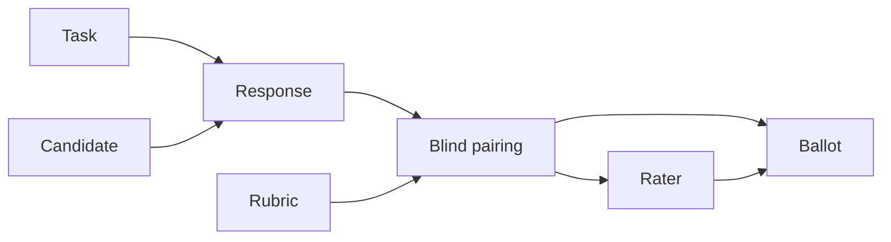

# Data model

FrontierTrials stores one JSON object per durable artifact and exact response content as Markdown.

## Task

The frozen prompt, supplied context, optional reference, category, tags, and rubric selection.

## Candidate

Observed product metadata: label, provider, model, surface, plan, version, and settings. It should
describe what the evaluator saw without claiming hidden routing.

## Response

A reference to exact Markdown plus capture timestamp, SHA-256, optional latency or token observations,
and descriptive counts.

## Rubric

Weighted criteria with labels, evaluation questions, and optional 1–5 anchors.

## Pairing

One task, two response IDs, anonymous side labels, assigned rater IDs, and an order index. Pairings
are generated from a complete response matrix.

## Ballot

One rater's preference, confidence, left/right criterion scores, rationale, and flags for one
pairing.

## Rater

A pseudonymous label, relevant expertise tags, and optional notes. Do not store unnecessary
personal data.

## Extension behavior

Validators allow extra properties so laboratories can add namespaced metadata. Core commands ignore
unknown fields. Published JSON Schemas live in [`schemas/`](../schemas/).

